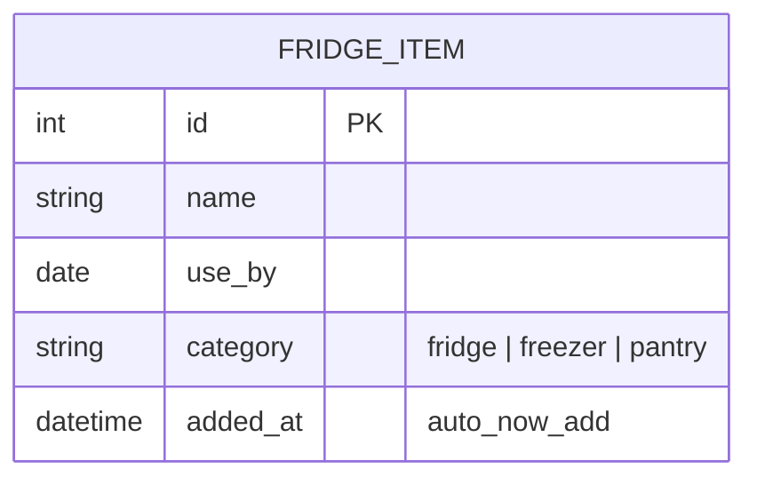
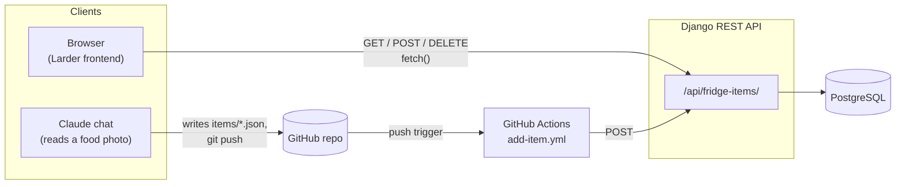
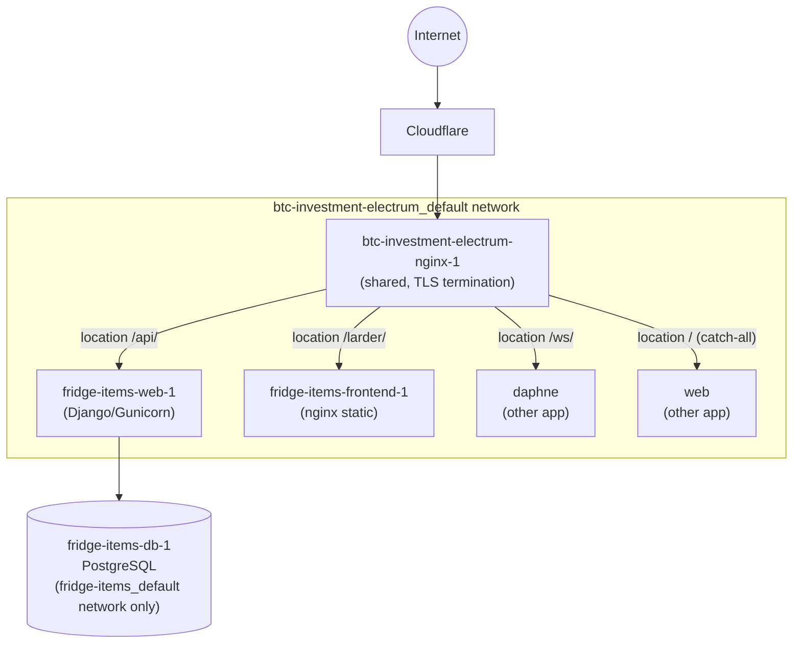
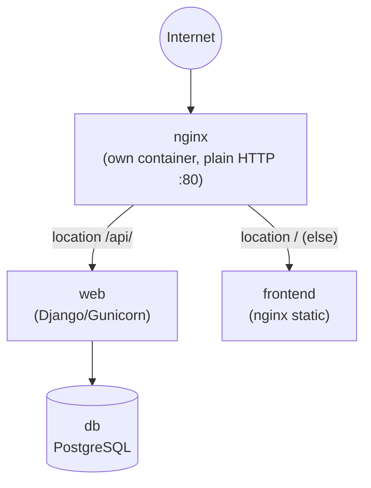
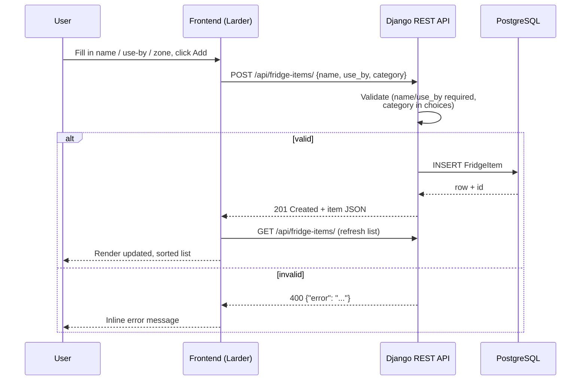
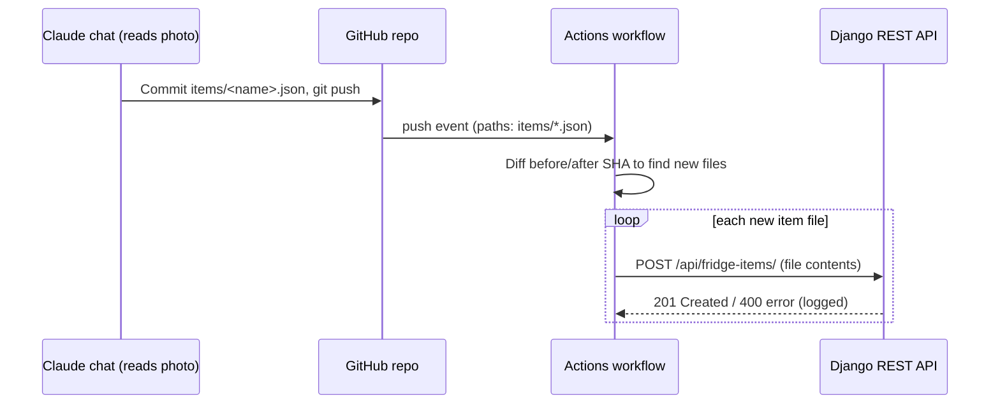

# Fridge Tracker — Architecture & Documentation

A single-user fridge/freezer/pantry expiry tracker: a Django REST API backed by
Postgres, a dependency-free static frontend, and a GitHub Actions pipeline
that lets items be added by pushing a JSON file (e.g. from a chat that just
read a product photo).

---

## 1. Tech stack

| Layer | Technology | Notes |
|---|---|---|
| Language / runtime | Python 3.12 | `python:3.12-slim` base image |
| Web framework | Django 6.0.7 | `config/` project, `fridge/` app |
| API layer | Django REST Framework 3.17.1 | `ListCreateAPIView` + `DestroyAPIView` |
| App server | Gunicorn 26.0.0 | sync worker, serves on `:8000` inside the container |
| Database | PostgreSQL 16 | `postgres:16-alpine` image, one named volume per deployment |
| DB driver | psycopg 3.3.4 (+ psycopg-binary) | via `dj-database-url` 3.1.2 parsing `DATABASE_URL` |
| CORS | django-cors-headers 4.9.0 | `CORS_ALLOW_ALL_ORIGINS = True` (no auth/sensitive data) |
| Frontend | Vanilla HTML5 / CSS3 / JS | single self-contained file, no framework, no build step |
| Fonts | Subset DejaVu (woff2, base64) | embedded via `@font-face` data URIs, ~50 KB total |
| Containers | Docker + Docker Compose | multi-service orchestration, two topologies (see §3) |
| Reverse proxy | nginx (`nginx:alpine`) | TLS/routing on hindex.uk; plain HTTP router on the standalone box |
| CI/CD | GitHub Actions | `.github/workflows/add-item.yml` |
| Source control | Git / GitHub | `lisakalex/fridge-tracker` |

Full pinned dependency list: `requirements.txt`.

---

## 2. Data model



`fridge/models.py` — ordered by `use_by` ascending at the DB level, so the API
returns soonest-expiring items first without the frontend needing to sort.

---

## 3. Logical architecture



Two independent ways to add an item exist side by side:

1. **Direct**: the static frontend calls the API's `fetch()` straight from the browser.
2. **Pipeline**: a photo gets turned into `items/<name>.json`, pushed to GitHub,
   and a workflow POSTs it automatically. See `items/README.md` for the file shape.

---

## 4. Deployments

The project runs as **two independent, fully separate deployments** (separate
databases — an item added on one does not appear on the other).

| | hindex.uk | Standalone (145.241.222.126) |
|---|---|---|
| Host | Shared VPS (also runs `btc-investment-electrum`) | Dedicated Oracle Cloud VM, Ubuntu 24.04 |
| Project path | `/var/www/api/fridge-items/` | `/home/ubuntu/fridge-tracker/` |
| Compose file | `docker-compose.yml` | `docker-compose.standalone.yml` |
| Reverse proxy | Shared `btc-investment-electrum-nginx-1` container | Own dedicated `nginx` container |
| TLS | Yes (Cloudflare + origin cert) | No — plain HTTP on the bare IP |
| API URL | `https://hindex.uk/api/fridge-items/` | `http://145.241.222.126/api/fridge-items/` |
| Frontend URL | `https://hindex.uk/larder/` | `http://145.241.222.126/` |
| `frontend/index.html` `API_BASE` | `hindex.uk` (matches the git-tracked default) | Patched post-deploy to its own IP — **not** committed |

### 4.1 hindex.uk topology

The shared nginx container belongs to a *different* Docker Compose project
(`btc-investment-electrum`) and cannot resolve this project's containers by
name unless explicitly joined to its network.



Only `web` and `frontend` join the shared network (by container name, since
`127.0.0.1` inside a container refers to itself, not the host); `db` stays on
its own isolated network — nothing outside this project can reach it.

nginx config lives outside this repo, on the host at
`/var/www/btc-investment-electrum/docker/nginx/conf.d/default.conf`; the
`/api/` and `/larder/` location blocks to add there are kept as reference in
`deploy/nginx-fridge-tracker.conf`.

### 4.2 Standalone topology

A completely self-contained stack — no shared infrastructure, no cross-project
networking gymnastics.



All four containers (`nginx`, `web`, `frontend`, `db`) belong to the same
Compose project and default network — `docker-compose.standalone.yml` up is
the entire deployment.

---

## 5. Request flow — adding an item

### 5.1 Via the frontend



### 5.2 Via GitHub Actions (photo → JSON → push)



`fetch-depth: 0` is required in the checkout step — the default shallow clone
would break the before/after diff on the very first real trigger.

---

## 6. API reference

Base path: `/api/fridge-items/` (no authentication — private/low-traffic use).

| Method | Path | Body | Response |
|---|---|---|---|
| `GET` | `/api/fridge-items/` | — | `200` array, sorted by `use_by` ascending |
| `POST` | `/api/fridge-items/` | `{name, use_by, category}` | `201` + created item, or `400 {"error": "..."}` |
| `DELETE` | `/api/fridge-items/<id>/` | — | `204` no content |

Item shape:

```json
{
  "id": 1,
  "name": "Dairy Manor Whole British Milk",
  "use_by": "2026-07-26",
  "category": "fridge",
  "added_at": "2026-07-18T16:32:00Z"
}
```

`category` ∈ `{fridge, freezer, pantry}`, defaults to `fridge` if omitted.

---

## 7. Repository layout

```
fridge-tracker/
├── config/                    Django project (settings, urls, wsgi/asgi)
├── fridge/                    Django app: model, serializer, views, urls
├── frontend/index.html        Self-contained static frontend ("Larder")
├── items/                     Drop zone for the GitHub Actions add-item pipeline
├── deploy/                    Reference nginx snippets (not auto-applied)
├── docs/                      This document
├── Dockerfile                 Python/Gunicorn app image
├── entrypoint.sh              Wait-for-db → migrate → collectstatic → gunicorn
├── docker-compose.yml         hindex.uk deployment (joins external nginx network)
├── docker-compose.standalone.yml  Dedicated-box deployment (bundles its own nginx)
├── .github/workflows/add-item.yml GitHub Actions pipeline
└── requirements.txt
```

---

## 8. Operational notes

- **Two independent databases.** Items added on one deployment do not appear
  on the other; there is no sync between them.
- **No TLS on the standalone server yet** — plain HTTP on the bare IP. Needs a
  domain pointed at `145.241.222.126` before Let's Encrypt can issue a cert.
- **Postgres is not exposed publicly** on either deployment. For direct DB
  access (e.g. DataGrip), tunnel over SSH rather than publishing `5432`.
- **Deploy-sync care:** `.env` and `frontend/index.html`'s `API_BASE` are
  *deliberately* different per deployment (fresh secrets; own API host).
  Automated file-sync tools (e.g. an IDE's SFTP deployment config) should
  exclude both, or they'll silently overwrite live secrets/config — this has
  happened once already on the standalone box.
- **`deploy/*.conf` files are reference only** — copy their contents into the
  real nginx config; don't let a sync tool drop them into `conf.d/` as
  standalone files (a bare `location` block outside a `server {}` is invalid
  nginx syntax and will fail `nginx -t`).
