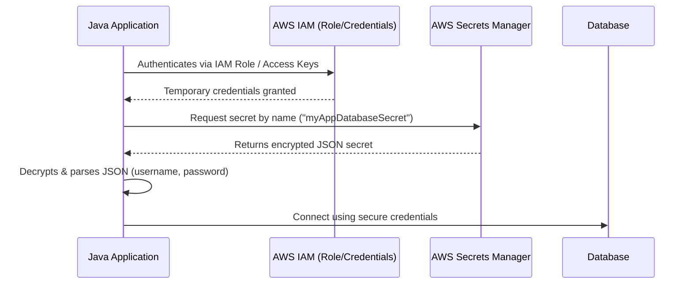

# Externalize credentials AWS

1. Complete **Java code implementation** for fetching credentials from AWS Secrets Manager
2. Required **Maven dependencies**
3. A **process diagram** visualizing how your app interacts with AWS Secrets Manager

---

## 1. **Maven Dependencies (`pom.xml`)**

Add the following to your `pom.xml`:

```xml

<dependencies>
    <!-- AWS SDK for Secrets Manager -->
    <dependency>
        <groupId>software.amazon.awssdk</groupId>
        <artifactId>secretsmanager</artifactId>
        <version>2.25.6</version>
    </dependency>

    <!-- AWS SDK Core (required by Secrets Manager) -->
    <dependency>
        <groupId>software.amazon.awssdk</groupId>
        <artifactId>core</artifactId>
        <version>2.25.6</version>
    </dependency>

    <!-- JSON Parser -->
    <dependency>
        <groupId>com.fasterxml.jackson.core</groupId>
        <artifactId>jackson-databind</artifactId>
        <version>2.17.0</version>
    </dependency>
</dependencies>
```

---

## 2. **AWS Secrets Manager Utility**

File: `src/main/java/com/example/security/AwsSecretManagerUtil.java`

```java
package com.example.security;

import software.amazon.awssdk.regions.Region;
import software.amazon.awssdk.services.secretsmanager.SecretsManagerClient;
import software.amazon.awssdk.services.secretsmanager.model.*;
import com.fasterxml.jackson.databind.ObjectMapper;

import java.util.Map;

public class AwsSecretManagerUtil {

    private static final ObjectMapper mapper = new ObjectMapper();

    /**
     * Fetches and returns a secret from AWS Secrets Manager.
     *
     * @param secretName The name or ARN of the secret in AWS
     * @param region     The AWS region (e.g., "us-east-1")
     * @return Map<String, String> of key-value pairs in the secret
     */
    public static Map<String, String> getSecret(String secretName, String region) {
        SecretsManagerClient client = SecretsManagerClient.builder()
                .region(Region.of(region))
                .build();

        try {
            GetSecretValueRequest request = GetSecretValueRequest.builder()
                    .secretId(secretName)
                    .build();

            GetSecretValueResponse response = client.getSecretValue(request);
            String secretString = response.secretString();

            // Convert JSON secret to Map
            return mapper.readValue(secretString, Map.class);

        } catch (SecretsManagerException e) {
            throw new RuntimeException("Error fetching secret: " + e.awsErrorDetails().errorMessage(), e);
        } catch (Exception e) {
            throw new RuntimeException("Unexpected error while parsing secret", e);
        } finally {
            client.close();
        }
    }
}
```

---

## 3. **Usage Example**

File: `src/main/java/com/example/app/App.java`

```java
package com.example.app;

import com.example.security.AwsSecretManagerUtil;

import java.util.Map;

public class App {
    public static void main(String[] args) {
        String secretName = "myAppDatabaseSecret";
        String region = "us-east-1";

        Map<String, String> secret = AwsSecretManagerUtil.getSecret(secretName, region);

        String username = secret.get("username");
        String password = secret.get("password");

        System.out.println("Connecting to DB with user: " + username);
        // Use these credentials to initialize your datasource or other clients
    }
}
```

---

## **Project Structure**

```txt
my-java-app/
├── pom.xml
└── src/
    └── main/
        ├── java/
        │   ├── com/example/app/App.java
        │   └── com/example/security/AwsSecretManagerUtil.java
        └── resources/
```

---

## 4. **Diagram: Credential Retrieval Process**

Below is a conceptual diagram of how your application securely fetches secrets from AWS Secrets Manager.



---

## **Security Notes**

* Always use IAM roles instead of static credentials.
* Rotate secrets regularly.
* Use environment variables or ECS task roles for AWS credentials.
