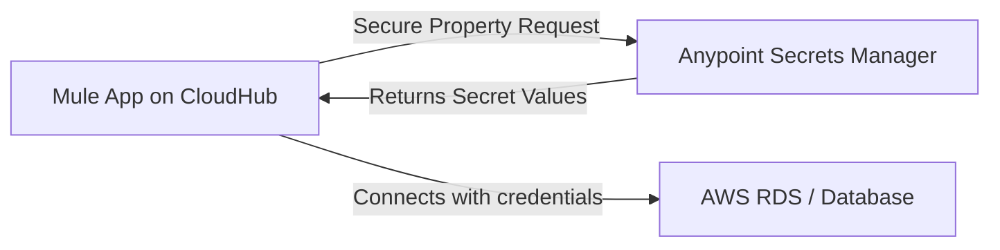

# Secure Mule app XML CloudHub

Below is a **complete, production-ready Mule 4 example** showing how to connect securely to a database using **Anypoint
Secrets Manager** on **CloudHub** — without storing any credentials in `pom.xml`, `properties`, or YAML files.

---

## 1. Prerequisites

Before you begin:

* You have access to **Anypoint Secrets Manager**.
* You have a **Secret Group** (e.g., `prod-db-secrets`).
* Within that group, you’ve stored:

    * `db.username`
    * `db.password`
* The CloudHub **environment** (e.g., `Production`) is linked to that secret group in Anypoint.

---

## 2. Mule Configuration: `mule-artifact.json`

Enable secure property resolution using Anypoint Secrets Manager:

```json
{
  "minMuleVersion": "4.4.0",
  "secureProperties": [
    "db.username",
    "db.password"
  ]
}
```

> Note: No values are stored here — this only tells Mule which properties are secure.

---

## 3. Database Configuration: `db-config.xml`

```xml
<?xml version="1.0" encoding="UTF-8"?>

<mule xmlns:db="http://www.mulesoft.org/schema/mule/db"
      xmlns="http://www.mulesoft.org/schema/mule/core"
      xmlns:xsi="http://www.w3.org/2001/XMLSchema-instance"
      xsi:schemaLocation="
          http://www.mulesoft.org/schema/mule/core http://www.mulesoft.org/schema/mule/core/current/mule.xsd
          http://www.mulesoft.org/schema/mule/db http://www.mulesoft.org/schema/mule/db/current/mule-db.xsd">

    <db:config name="Secure_DB_Config"
               host="prod-db.cluster-abcdefg.us-east-1.rds.amazonaws.com"
               port="3306"
               user="${secure::db.username}"
               password="${secure::db.password}"
               database="customerdb"
               doc:name="Database Configuration"/>
</mule>
```

Here, `secure::` instructs Mule to retrieve those secrets at runtime from **Anypoint Secrets Manager**, not from local
files.

---

## 4. Application Flow: `main-flow.xml`

```xml
<?xml version="1.0" encoding="UTF-8"?>

<mule xmlns:db="http://www.mulesoft.org/schema/mule/db"
      xmlns="http://www.mulesoft.org/schema/mule/core"
      xmlns:xsi="http://www.w3.org/2001/XMLSchema-instance"
      xsi:schemaLocation="
          http://www.mulesoft.org/schema/mule/core http://www.mulesoft.org/schema/mule/core/current/mule.xsd
          http://www.mulesoft.org/schema/mule/db http://www.mulesoft.org/schema/mule/db/current/mule-db.xsd">

    <flow name="fetch-customers">
        <db:select config-ref="Secure_DB_Config">
            <db:sql>SELECT id, name, email FROM customers LIMIT 10</db:sql>
        </db:select>
        <logger level="INFO" message="Fetched #[payload.size()] customers"/>
    </flow>
</mule>
```

This flow retrieves a list of customers from the database securely, with credentials resolved at runtime.

---

## 5. Deployment Steps (CloudHub)

1. Deploy the app using **Runtime Manager** → **Deploy Application**.
2. Choose your **environment** (e.g., `Production`).
3. Ensure that this environment has access to your **Secret Group** in Anypoint Secrets Manager.
4. Do *not* add username or password properties manually — Mule retrieves them automatically.

---

## 6. Architecture Overview



This setup ensures your credentials are never stored in the application repository, local configuration, or deployment
descriptor.

---

## 7. Advantages

* Zero secrets in your codebase or deployment config
* Centralized credential management via Anypoint
* Easy rotation and revocation of credentials
* Encrypted at rest and in transit
* Seamless integration with CloudHub runtime
