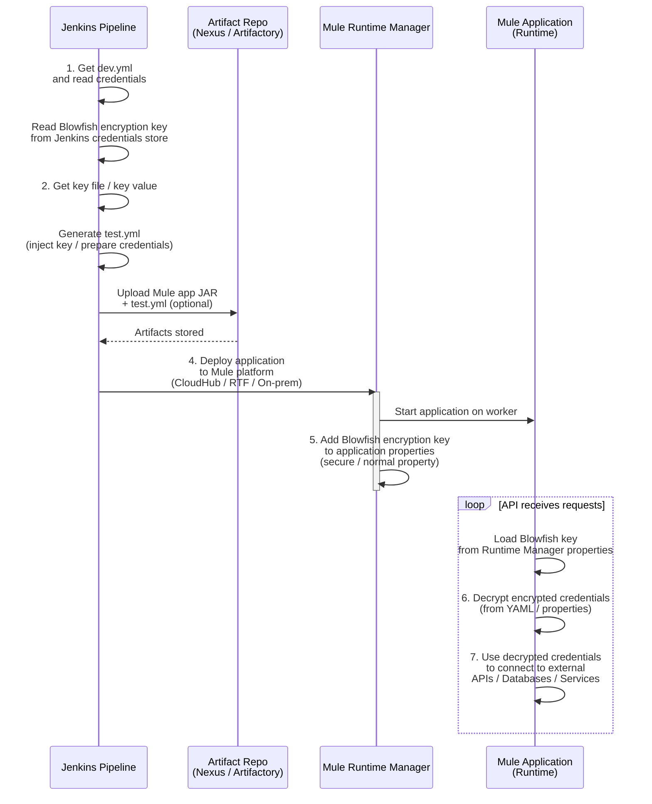

This Jenkins pipeline automates deployment of a MuleSoft API while ensuring credential security.
Jenkins retrieves dev.yml from the repository and extracts credentials.
It reads a key file to generate a new test.yml configuration dynamically.
The Blowfish encryption key is securely fetched from Jenkins credentials.
The API package is deployed to the Mule runtime platform.
Jenkins sets the Blowfish key as a runtime property in Mule Runtime Manager.
At runtime, the API decrypts its credentials using the Blowfish key.
The decrypted credentials are used to connect securely to other APIs or databases.

Would you like me to render this diagram visually (as an image swimlane chart) for presentation or documentation use?

sequenceDiagram
participant J as Jenkins Pipeline
participant AR as Artifact Repo (Nexus/Artifactory)
participant RM as Mule Runtime Manager
participant Mule as Mule Application (Runtime)

[//]: # (![mermaid-diagram.svg]&#40;img/mermaid-diagram.svg&#41;)

