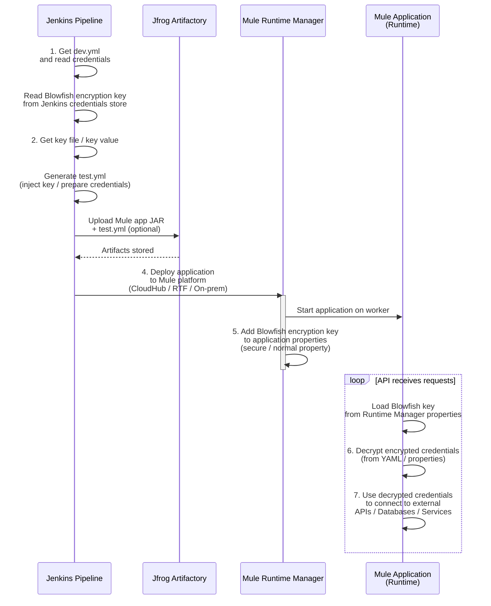

# Secure Mule Deployment Pipeline

This Jenkins-based CI/CD process securely deploys a MuleSoft application to Anypoint Platform (CloudHub / Runtime
Fabric). Sensitive credentials are encrypted using Blowfish in YAML files. The encryption key is managed securely in
Jenkins during build and added to Runtime Manager properties for runtime decryption. The Mule API then uses the
decrypted credentials to connect to databases or external APIs.

### Process Steps

1. Retrieve `dev.yml` from source control (AWS CodeCommit)
2. Use the key file (with credentials) to create `test.yml`
3. In Jenkins pipeline, fetch the Blowfish encryption key from secure credentials store
4. Build the Mule application (Maven) and deploy it to Anypoint Platform via Runtime Manager
5. In Runtime Manager, add the Blowfish key as a secure application property
6. At runtime, Mule uses the Secure Configuration Properties module + Blowfish key to decrypt credentials
7. The application starts and securely connects to databases or other APIs using the decrypted values

This approach keeps credentials encrypted in source control and artifacts, with decryption only happening at runtime on
the Mule platform.

