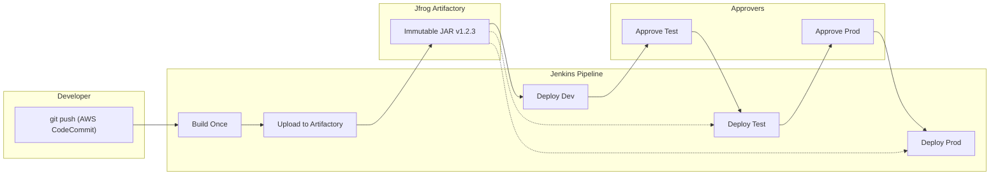

---
hide:
  - navigation
  - toc
  - header
  - footer
---

# Swimlane (shows who owns what)

```mermaid
flowchart LR
    subgraph Developer
        A["git push (AWS CodeCommit)"]
    end
    subgraph Jenkins Pipeline
        B["Build Once"]
        C["Upload to Artifactory"]
        D["Deploy Dev"]
        E["Deploy Test"]
        F["Deploy Prod"]
    end
    subgraph Jfrog Artifactory
        G["Immutable JAR v1.2.3"]
    end
    subgraph Approvers
        H[Approve Test]
        I[Approve Prod]
    end

    A --> B --> C --> G
    G --> D --> H --> E --> I --> F
    G -.-> E
    G -.-> F

%%    style G fill:#aa6770,color:white
%%    style H fill:#a99045,color:black
%%    style I fill:#4a7e56,color:white
```

