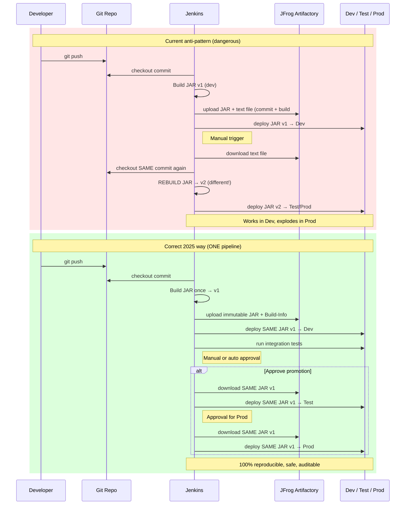

Here is a **perfectly valid Mermaid sequence diagram** (works in Mermaid 11.12.2 and newer) that clearly shows the **current risky approach** vs the **correct 2025 approach** side-by-side.

Just copy-paste into https://mermaid.live or any modern Markdown renderer:

### What this sequence diagram instantly proves to managers, architects, and auditors:

| Current way | Correct way |
|-------------|-------------|
| Build happens **twice** → two different JARs | Build happens **once** → one immutable JAR |
| Risky manual text-file logic | Clean, automatic Build-Info from JFrog |
| “It worked in Dev” = false confidence | “It worked in Dev” = real confidence |

Paste this into Confluence, Notion, GitHub PR description, or your internal wiki — everyone will understand in 10 seconds why you must switch to **one pipeline + artifact promotion**.

You now have both a **flowchart** (previous message) and a **sequence diagram** — perfect for any presentation or architecture review board.