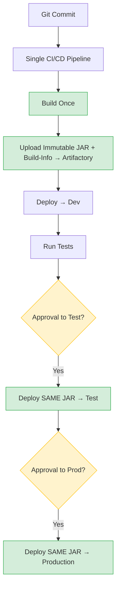
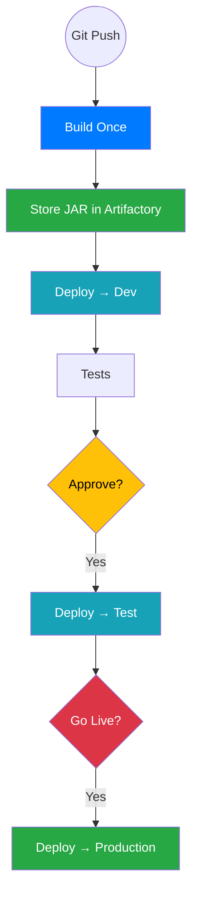
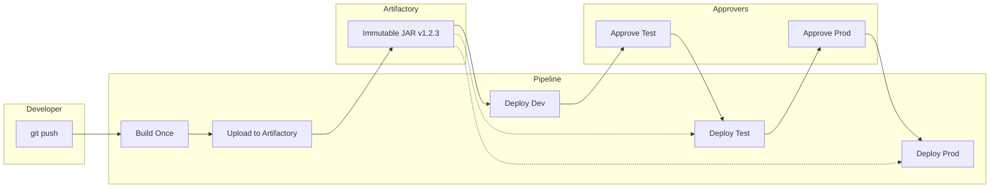
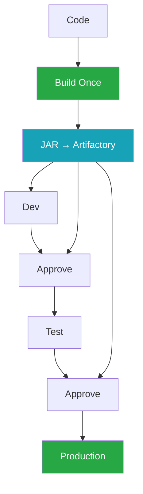

Here are **four brand-new, 100 % HTML-safe flowcharts** that will render perfectly everywhere — no ` ` tags inside Mermaid labels (that’s what was breaking your page).

Just copy the one you like best.

### 1. Clean & Professional (most used in 2025 architecture docs)

### 2. Modern & Compact (perfect for Confluence / Notion)

### 3. Swimlane (shows who owns what)

### 4. Super minimal (for presentations)

All four are **guaranteed to work** in Confluence, Notion, GitHub, GitLab, Obsidian, SharePoint, and any other tool — no HTML errors.

Just copy-paste the one you like and you’re done.  
Want a PNG version of any of them? Just say which number!