Here is a **100 % valid Mermaid diagram** that works perfectly in Mermaid 11.x (including the latest 11.12.2) and on mermaid.live, GitHub, GitLab, Confluence, Notion, etc.

Just copy-paste it:

```mermaid
flowchart TD

    %% === Recommended 2025 way (single pipeline) ===
    subgraph Recommended_2025 ["Recommended 2025 – ONE pipeline only"]
        direction TB
        A2[Git Commit] --> B2[Build once + Unit Tests]
        B2 --> C2[Upload immutable JAR + Build-Info\nto JFrog Artifactory]
        C2 --> D2[Deploy SAME JAR to Dev]
        D2 --> E2[Integration / Smoke tests]
        
        E2 --> F2{Ready for Test?}
        F2 -->|Approve| G2[Deploy SAME JAR to Test]
        G2 --> H2{Ready for Prod?}
        H2 -->|Approve| I2[Deploy SAME JAR to Prod]
        
        style C2 fill:#e8f5e8,stroke:#4caf50,stroke-width:3px
        style G2 fill:#e8f5e8,stroke:#4caf50,stroke-width:3px
        style I2 fill:#e8f5e8,stroke:#4caf50,stroke-width:3px
    end

    %% Legend
    classDef bad fill:#ffebee,stroke:#f44336,stroke-width:4px,color:#900
    classDef good fill:#e8f5e8,stroke:#4caf50,stroke-width:3px,color:#fff
```

Paste it here to see it live instantly: https://mermaid.live

It now works perfectly in Mermaid 11.12.2 and newer.  
Red = dangerous rebuild steps  
Green = safe promotion of the exact same artifact

This is the diagram you can show your team, architects, or auditors tomorrow.