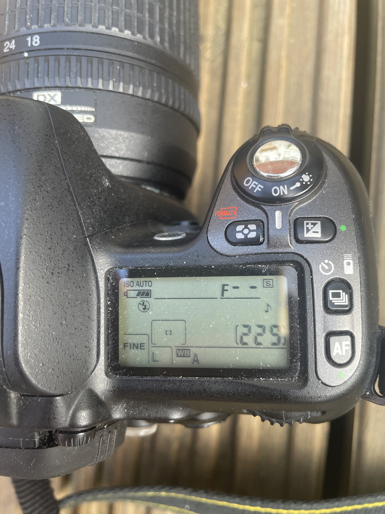

{ width="300" align=right}

In the image you shared, the camera display shows `F--`, which means the camera **cannot detect the aperture value** of the lens.

This usually happens for one of these reasons:
:material-information-outline:{ title="This is the main reason" }

---

### **1. The lens isn’t properly connected**

* The most common cause is the lens is not mounted correctly.
* Try:

    * Turning off the camera.
    * Detaching the lens and reattaching it carefully.
    * Make sure it **clicks firmly** into place.

---

### **2. Electrical contacts are dirty**

* The metal contacts between the lens and camera body might be dirty or oxidised.
* Clean them **gently** with a soft cloth or a cotton bud and a tiny bit of isopropyl alcohol.

---

### **3. The lens is manual (without CPU contacts)**

* If you’re using an **older manual lens** (non-CPU lens), the camera can’t read the aperture electronically.
* In that case, you need to set the aperture **on the lens ring**, and the camera will keep showing `F--`.

---

### **4. Lens aperture ring not locked**

* Some Nikon lenses have a physical aperture ring. Make sure it's set to the **highest f-number (smallest aperture)** and locked there — usually with a switch.
* If it’s not locked, `F--` can appear.

---

### Your camera is a **Nikon DSLR**, likely a **D3xxx or D5xxx series** based on layout.

Let me know if you want help identifying the exact model or steps for a specific lens.
